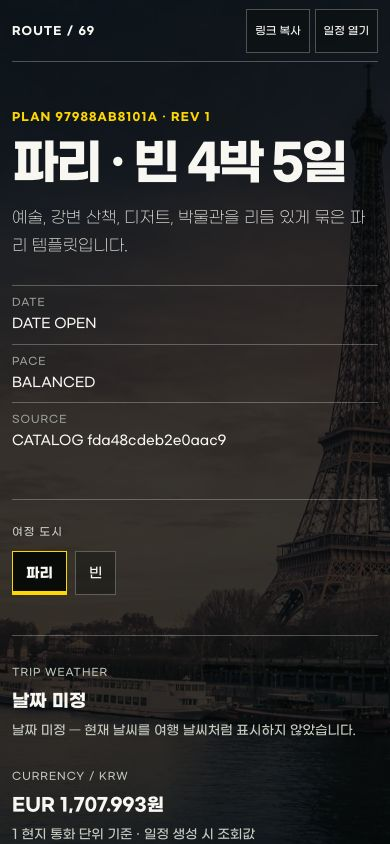
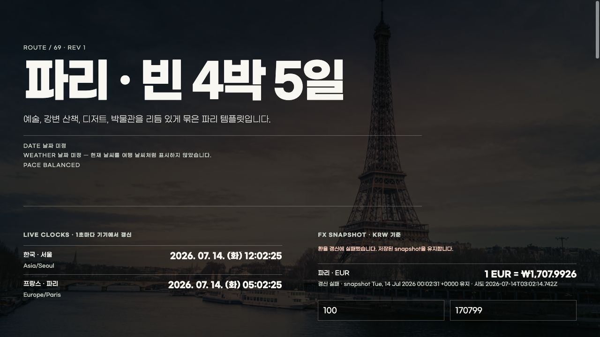

# Travel City Planner MCP

원본 **Tour City Planner**의 69개 도시 템플릿을 하나의 canonical JSON으로 보존하고, 자연어 요청을 커스터마이징 가능한 여행 계획으로 바꾸는 Python FastMCP v1 서버입니다.

`도쿄로 4-5박 정도 머무를 건데 애니와 맛집 위주로 추천 플래너 짜줘`처럼 말하면 5박 6일 기본안과 4박 5일 단축 힌트가 즉시 나옵니다. 날짜가 없을 때 현재 날씨를 여행 날짜의 날씨처럼 표시하지 않습니다. 결과 viewer에는 선택 도시의 이미지, 서울·현지 실시간 시계, 최신 KRW 환율, 도시별 기본 회화, 장소별 지도와 인접 장소 사이 이동 경로가 함께 표시됩니다.

도시 사진을 전체 화면 배경으로 쓰고 단색 dark matte만 얹은 fieldnote UI입니다. G마켓 산스 Light·Medium·Bold를 저장소에 직접 포함해 viewer와 독립 HTML export가 같은 글꼴과 밀도를 유지합니다.


<details>
<summary>모바일 viewer와 독립 HTML export 보기</summary>





</details>

## 핵심 구조

- `data/destinations.json`: 원본 69개 `DESTINATIONS`의 유일한 원장. MCP와 viewer가 같은 파일을 읽습니다.
- `planner/`: 자연어 기간·도시 파싱, 템플릿 계획, 다도시 병합, 압축 토큰, revision mutation, 날씨·환율·시계·경로, export.
- `viewer/`: 빌드 과정 없는 모바일 정적 viewer. `tp1.` content token을 브라우저에서 직접 압축 해제합니다.
- `examples/demo-plan.json`: 실제 예약이나 개인 정보가 아닌 fictional 도쿄 5박 6일 데모.
- `tests/`: 69개 데이터, 4-5박 해석, 날씨 안전장치, 다도시, token 재시작 복원, revision 충돌, 지도 query, legacy 규격 테스트.

## MCP 도구

| 도구 | 용도 |
|---|---|
| `list_destinations` | 69개 도시를 한글/영문/지역으로 검색 |
| `get_city_guide` | 도시 이미지·서울/현지 시각·기본 회화·지도·최신 환율 조회 |
| `get_route_options` | 두 장소 사이 대중교통·도보·자동차 Google Maps 경로 생성 |
| `plan_trip` | 한국어 자연어를 즉시 일정으로 변환 |
| `create_plan` | JSON segments로 단일/다도시 일정 생성 |
| `mutate_plan` | revision 확인 후 활동 추가·수정·삭제·이동 |
| `get_plan` | 압축 content token 복원 |
| `export_plan` | 큰 HTML/JSON/원본 v3 공유 규격을 분리 export |
| `validate_plan` | token·catalog·icon·revision 구조 검증 |

기본 생성/수정 응답에는 `html`이 없습니다. `summary`, compact itinerary, `content_token`, `viewer_url`만 반환하며, 큰 HTML은 `export_plan(content_token, format="html")`로 받습니다. `include_html=true`는 명시적인 호환 옵션입니다.

모든 도구는 문자열 안에 JSON을 숨기지 않고 MCP `structuredContent`와 명시적인 `outputSchema`를 반환합니다. 도구별 title과 read-only/destructive/idempotent/open-world 힌트도 함께 노출합니다.

## 여행 중 유틸리티

- **도시별 이미지:** 69개 목적지 모두 서로 다른 hero를 가지며, 멀티시티 viewer에는 각 segment 이미지가 함께 표시됩니다. 알 수 없는 도시 ID를 도쿄로 조용히 바꾸지 않고 오류로 처리합니다.
- **서울·현지 시간:** IANA time zone과 브라우저 `Intl.DateTimeFormat`으로 1초마다 갱신합니다. `get_city_guide`는 동일 시점의 ISO 시각과 UTC offset이 반영된 snapshot도 반환합니다.
- **최신 환율:** 일정 생성 시와 viewer 재오픈 시 `open.er-api.com`에서 `현지 통화 1단위 → KRW`를 조회하고 viewer가 15분마다 새로 확인합니다. 조회시각·제공처 갱신시각·실패 상태를 구분하며, API 제공값보다 더 실시간인 것처럼 꾸미지 않습니다. 양방향 금액 계산기도 포함합니다.
- **기본 번역/회화:** 원본에 있던 도시별 251개 표현을 현지어·발음·한국어 뜻으로 표시하고 검색합니다. 임의 문장을 번역했다고 추측하지 않습니다.
- **지도와 이동:** 각 장소의 Google Maps 검색, 하루 전체 route, 모든 인접 장소 A→B의 `transit`·`walking`·`driving` 링크를 제공합니다. 거리·소요시간·운행 여부는 임의 생성하지 않고 링크를 여는 시점의 Google Maps 결과로 확인합니다.
- **도시 전환:** 멀티시티 버튼을 누르면 전체 배경, 도시 요약, 현지 시계, 환율, 회화, 지도 목적지가 한 번에 같은 도시로 전환됩니다. 도시명이나 예시 인물명은 코드에 고정하지 않습니다.

공식 [Google Maps URLs](https://developers.google.com/maps/documentation/urls/get-started)는 API key 없이 검색과 길찾기를 열 수 있습니다. 화면 안 공식 Google Maps Embed API는 별도 key가 필요하므로 이 프로젝트는 공개 key를 묶지 않고 공식 외부 경로 링크를 기본값으로 사용합니다.

## 자연어 예시

```text
도쿄로 4-5박 정도 머무를 건데 애니와 맛집 위주로 추천 플래너 짜줘
```

선택 규칙:

- `4-5박` → 기본 5박 6일
- 응답의 `shorter_variant` → 4박 5일로 줄일 날짜 힌트
- 날짜 미정 → `weather.status=date_required`; 현재 기온으로 대체하지 않음
- `도쿄 3박, 타이베이 2박` → 이동일을 겹쳐 5박 6일 다도시 일정

구조화 생성의 `segments_json` 예시:

```json
[
  {"destination_id": "tokyo", "nights": 3},
  {"destination_id": "taipei", "nights": 2}
]
```

수정 예시:

```json
[
  {
    "op": "update_activity",
    "day": 2,
    "activity_id": "act-...",
    "changes": {
      "title": "가마쿠라 대불",
      "location": "Kotoku-in, Kamakura",
      "icon": "landmark"
    }
  }
]
```

`mutate_plan`은 `expected_revision`과 token 내부 revision, 프로세스 내 최신 head를 비교합니다. 충돌 시 `REVISION_CONFLICT`를 반환합니다. 일정 본문은 `_TRIPS` 같은 메모리 ID가 아니라 zlib 압축 `tp1.` token에 들어 있으므로 서버가 재시작돼도 `get_plan`과 viewer에서 복원됩니다.

## 로컬 실행

```bash
python3 -m venv .venv
source .venv/bin/activate
pip install -r requirements-dev.txt
python server.py
```

- MCP: `http://127.0.0.1:8000/mcp`
- viewer: `http://127.0.0.1:8000/viewer`
- health: `http://127.0.0.1:8000/health`

공개 배포에서는 `PUBLIC_BASE_URL=https://your-host.example`을 설정해야 응답의 `viewer_url`이 절대 공개 주소가 됩니다. `HOST`, `PORT`, `MCP_TRANSPORT`도 지원합니다. DNS rebinding 방어는 기본 활성화되어 있으며 `PUBLIC_BASE_URL`의 host/origin과 로컬 개발 주소를 허용합니다. 역프록시나 별도 웹 클라이언트를 쓸 때만 `ALLOWED_HOSTS`, `ALLOWED_ORIGINS`에 쉼표로 구분한 값을 추가하세요.

```bash
pytest
python scripts/smoke_mcp.py
docker build -t travel-city-planner-mcp .
docker run --rm -p 8000:8000 -e PUBLIC_BASE_URL=http://localhost:8000 travel-city-planner-mcp
```

`scripts/smoke_mcp.py`는 임의의 로컬 포트에서 실제 Streamable HTTP 서버를 띄워 initialize/listTools/callTool, 알 수 없는 Host 거부, 비도쿄 도시 guide, 기본 회화, 세 이동수단 경로, 도쿄 4-5박 생성, token 복원, revision 충돌, HTML·legacy export, viewer·catalog·live guide 경로까지 왕복 검증합니다.

## Relay10 하네스

저장소 루트의 `relay10.config.json`이 scout → architect → maker → reviewer → explainer 역할, 위험도 기반 모델·reasoning 라우팅, 최대 모델 호출 수, deterministic Reader-10 명료도 검사, 테스트·MCP smoke 검증을 고정합니다. `.relay10/` 실행 기록은 로컬에만 남고 설정은 버전 관리합니다.

```bash
git clone https://github.com/minwoo19930301/relay10
cd relay10 && npm link
cd /path/to/travel-city-planner-mcp

r10 doctor
PYTHON=.venv/bin/python r10 route "사진 배경 여행 viewer와 export를 최종 검증" --json
PYTHON=.venv/bin/python r10 run "사진 배경 여행 viewer와 export를 최종 검증" \
  --budget-calls 5 \
  --allow-verification-commands
```

Reader-10 점수는 문서의 명료도 검사이며 기능·보안의 진실 판정으로 쓰지 않습니다. 최종 통과 여부는 reviewer 판정과 pytest, JavaScript 구문 검사, 실제 MCP Streamable HTTP smoke를 함께 봅니다.

## 공유 호환 규격

새 viewer는 `tp1.<base64url(zlib(JSON))>` content token을 사용합니다. plan schema v1에는 `plan_id`, `revision`, `segments`, `days`, 활동의 `location`/`map_query`, 인접 활동별 `legs`, live-data 상태가 포함됩니다. 초기 배포에서 발급한 `legs` 없는 v1 token도 열 때 결정적으로 보완하므로 계속 사용할 수 있습니다.

`export_plan(format="legacy_v3")`은 원본 Tour City Planner의 다음 규격을 생성합니다.

```json
{
  "v": 3,
  "g": [{"d": "tokyo", "s": "2026-09-01", "e": "2026-09-06"}],
  "i": [{"a": [{"d": "tokyo", "h": "10:00", "l": "Shibuya Sky", "k": "building", "m": ""}]}]
}
```

아이콘은 원본 `ACTIVITY_ICON_OPTIONS`의 27개 값으로 normalize합니다. 지도는 좌표를 임의 재사용하지 않고 `location + city` place query로 생성하며, location 변경 시 map query도 다시 계산됩니다.

## 원본 출처와 데이터 갱신

- 원본: [minwoo19930301/tour-city-planner](https://github.com/minwoo19930301/tour-city-planner)
- 가져온 기준 commit: `c0e544f604adfdc52d5c2c93480c5ac4d0aeea7e`
- 원본의 69개 목적지, 672개 활동 템플릿, 문구, 색상, 시간대, 통화, hero 참조를 `data/destinations.json`에 보존했습니다.
- `scripts/import_legacy_catalog.mjs <path-to-original-app.js>`는 원본 JS 데이터에서 canonical JSON을 다시 만드는 감사용 도구입니다.
- hero 이미지는 원본 저장소에서 변경 없이 가져왔습니다. 파일별 EXIF 기반 저작자 단서와 재사용 시 주의사항은 [ASSET_CREDITS.md](ASSET_CREDITS.md)를 확인하세요. 원본 저장소의 라이선스가 제3자 이미지 권리까지 대신 보증하지는 않습니다.
- G마켓 산스 WOFF2 세 굵기는 G마켓 공식 배포본이며 SIL Open Font License 1.1 전문을 `LICENSES/GmarketSans-OFL-1.1.txt`에 함께 보존했습니다. 파일 출처와 SHA-256은 [ASSET_CREDITS.md](ASSET_CREDITS.md)에 기록했습니다.

viewer가 별도 복사본을 갖지 않으며 실행 시 서버의 `/data/destinations.json`을 그대로 읽습니다.

## 라이선스

원본과 동일한 **CC BY-NC 4.0** 및 원본의 상업 이용 특별 조항을 유지합니다. 비영리·개인 학습·연구 외 상업적 이용은 저작권자와 별도 계약이 필요합니다. 자세한 내용은 [LICENSE](LICENSE)를 확인하세요.
